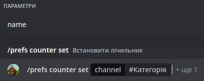
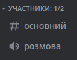
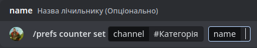
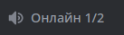
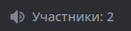
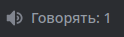

# Допомога по встановленню лічильника онлайну та участників серверу

Щоб встановити лічильник, все що Вам потрібно це скористатись командою `/prefs counter set` та вказати голосовий канал або категорію, назва якої буде оновлюватись.

Після використання команди зачекайте **до 5 хвилин** допоки назва оновиться

# Користувацька назва лічильника

Якщо Ви бажаєте використовувати свою назву каналу замість назви за змовчуванням, Ви можете це зробити при використанні команди `/prefs counter set`, просто вкажіть додатковий параметр `name` 

## **Майте на увазі, що Вам потрібно вказати, що саме в назві буде замінятись на онлайн.**

**Зробити це можна використовуючи ключові слова:**

`ON` - заміняється на онлайн серверу (боти не враховуються)

`(ОНЛАЙН)` - заміняється на онлайн серверу (боти не враховуються)

`[ОНЛАЙН]` - заміняється на онлайн серверу (боти не враховуються)

`MEM` - заміняється на кількість участників серверу (боти не враховуються)

`(УЧАСТНИКИ)` - заміняється на кількість участників серверу (боти не враховуються)

`[УЧАСТНИКИ]` - заміняється на кількість участників серверу (боти не враховуються)

`ALL` - заміняється на кількість участників серверу (боти не враховуються)

`BOT` - заміняється на кількість ботів серверу

`VC` - заміняється на кількість участників серверу, що знаходяться в голосовому каналі (боти не враховуються)

## Приклади використання:

### `Онлайн ON/MEM`

### `Участники: (УЧАСТНИКИ)`

### `Говорять: VC`

# Примітки

1. Discord API **не дозволяє ботам оновлювати назву каналу частіше ніж 2 рази за 10 хвилин**. Тому ми вимушені зробити обмеження частоти оновлення до **1 раз на 5 хвилин**.
2. Ви можете встановити **тільки 1 лічильник на сервер**
3. Якщо бот не бачить канал, котрий Ви вказали, дані про канал будуть прибрані з бази данних та Вам потрібно буде поставити лічильник знову.
4. Бот **не зможе** оновлювати назву каналу, якщо в нього немає необхідних прав **(Керувати каналом)**
5. Якщо Ви встановили голосовий канал в якості лічильнику, ми рекомендуємо **заборонити участникам приєднуватись та писати в ньому.** Якщо Ви не плануєте розмовляти в ньому.